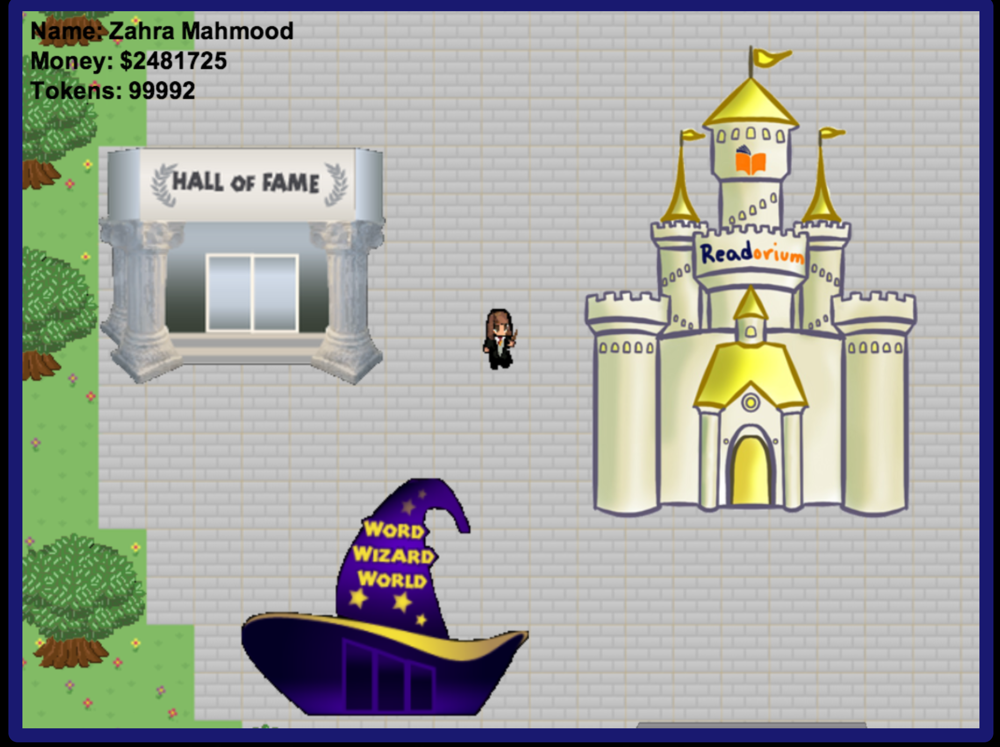
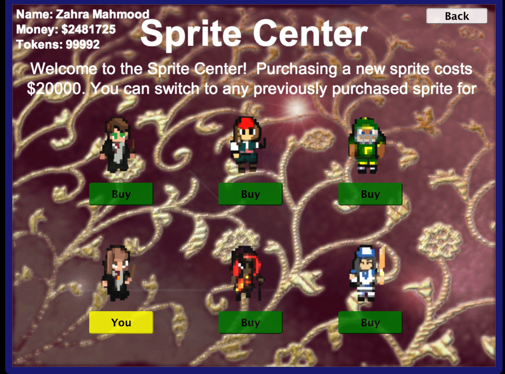
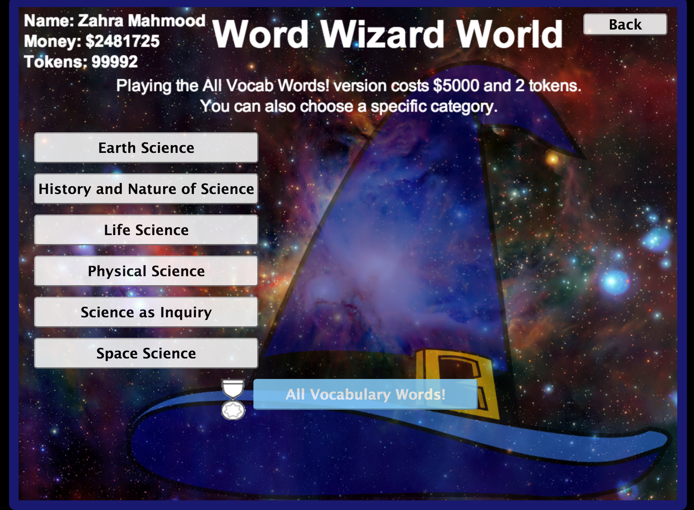
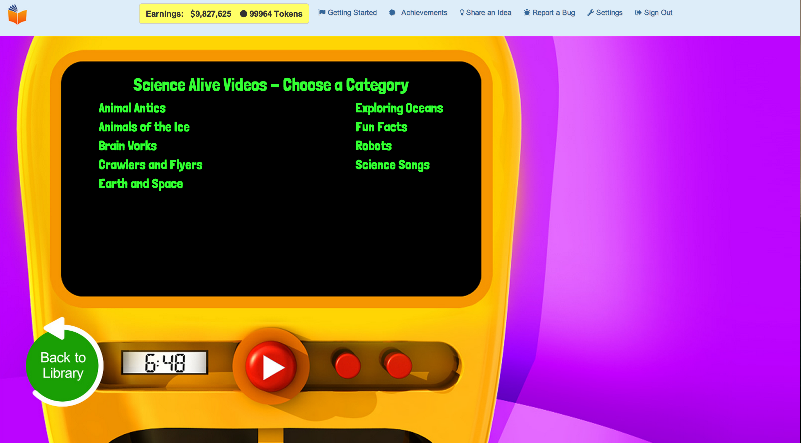
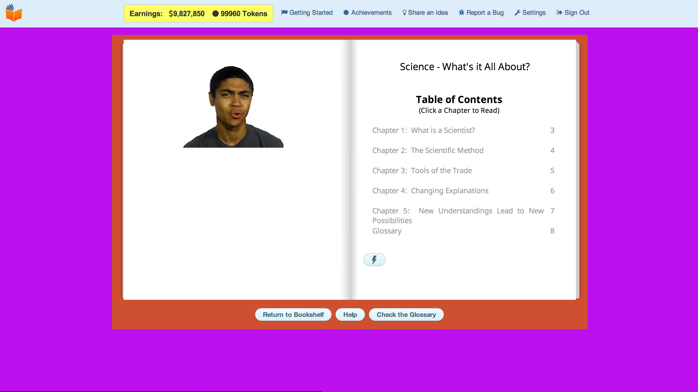

Readorium
=========

Summer 2013 Intern / Winter 2014 Employee

As a tech intern at Readorium by ©Mtelegence Corporation, I worked with a team of two people to redesign the flash-based Emporium from scratch to make it conform to the next-generation HTML5 standards. Using the Construct 2 game engine, my team made the website fully compatible for iOS platforms. The following pictures show the Emporium in HTML5: 

<<<<<<< HEAD

The sprites were animated using the Construct 2 game engine, and some of the artwork, such as the castle in the picture above, was designed by me. 

The Emporium allowed users to be able to switch sprites: 

And be able to play word games in the Word Wizard World: 

The website has book topics, called threads, that keep track of how far a child has progressed in his/her reading, and adjusts the vocabulary to tailor to the child's individual needs. The website osts different multimedia, including pictures, sound recordings, and vidoes to suppor children as they learn to read. Here are some more screenshots of the different aspects of the website:

The picture above shows the library as the website shifted focus to a more streamlined approach to show all the contents of the website. This new version of the website, dubbed Readorium Rising Reader, was where my team and I spent most of our time. We migrated the entire database and refactored the back-end to the new version of the website.

The Emporium was replaced from the sprite-based system with a block-like theme, to a more visually dynamic Emporium. 

These are other screenshots of the website depicting the Video Vendor, where children can access videos to support their reading, and the book threads where they can read the books. I contributed to the writing of these books, having authored three books myself. 

Thank you for taking interest in this project. Since the source code for this website is property of ©Mtelegence Corporation, I cannot disclose it on GitHub. If you have any further questions, please feel free to email me at zahramahmood@college.harvard.edu
=======
>>>>>>> FETCH_HEAD
